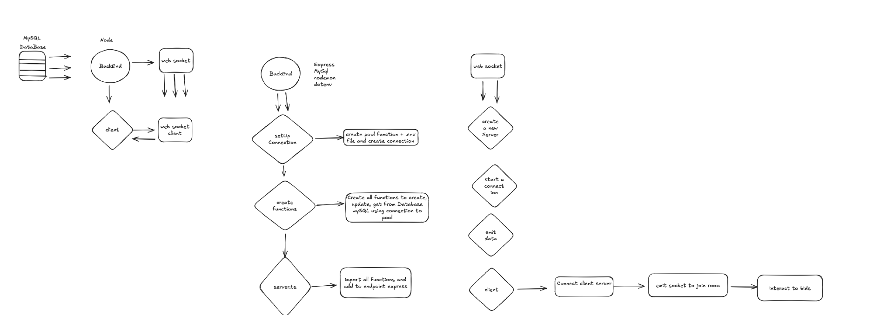
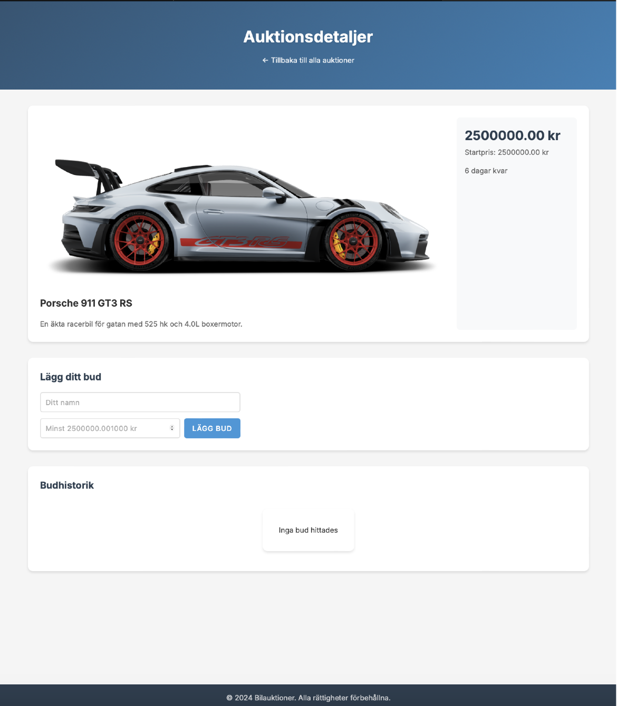

# Auction Site with WebSockets

## Implementation Overview

### Backend Setup

#### Socket.IO Server Configuration
```typescript
const io = new Server(server, {
    cors: {
        origin: "http://localhost:5173",
        methods: ["GET", "POST"],
        credentials: true
    },
    pingTimeout: 60000,
    transports: ['websocket', 'polling']
});
```

#### Connection & Room Management
```typescript
io.on('connection', (socket: Socket) => {

    // Join auction room
    socket.on('join-auction', async (auctionId: string) => {
        try {
            socket.join(auctionId);
            
            // Fetch auction data and bid history
            const [auction, bids] = await Promise.all([
                getCarById(auctionId),
                getBidByAuctionId(auctionId)
            ]);

            // Send initial data to client
            socket.emit('auction-joined', { 
                auction, 
                bids,
                message: `Connected to auction ${auctionId}`
            });
        } catch (error) {
            socket.emit('auction-error', { 
                error: 'Failed to join auction',
                details: error instanceof Error ? error.message : 'Unknown error'
            });
        }
    });

    // Handle new bids
    socket.on('send-bid', async (bid: Bid) => {
        try {
            const savedBid = await createBid(bid);
            io.to(bid.auctionId).emit('new-bid', savedBid);
            socket.emit('bid-confirmed', savedBid);
        } catch (error) {
            socket.emit('bid-error', {
                error: 'Failed to place bid',
                details: error instanceof Error ? error.message : 'Unknown error'
            });
        }
    });

    // Handle disconnection
    socket.on('disconnect', (reason) => {
        console.log(`Client ${socket.id} disconnected: ${reason}`);
    });
});
```

### Frontend Implementation

#### Socket Connection (socket.ts)
```typescript
export const socket = io("http://localhost:3001", {
    withCredentials: true,
    transports: ['websocket', 'polling']
});

socket.on("connect_error", (error) => {
    console.error("Socket connection error:", error);
});
```

#### Auction Room Management (room.ts)
```typescript
// Join auction room
if (auctionId) {
    socket.emit('join-auction', auctionId);
    getAuctionDetails();
}

// Handle new bids
socket.on('new-bid', (bid) => {
    if (!currentAuction || bid.auctionId !== currentAuction.id) return;
    
    // Ensure timestamp
    if (!bid.createdAt) {
        bid.createdAt = new Date().toISOString();
    }

    // Update auction price
    currentAuction.currentPrice = bid.amount;
    displayAuctionDetails();

    // Add new bid to history
    const bidElement = document.createElement('div');
    bidElement.className = 'bid-item';
    bidElement.innerHTML = `
        <span class="bid-user">${bid.name}</span>
        <span class="bid-amount">${Number(bid.amount).toLocaleString()} kr</span>
        <span class="bid-time">${formatDate(new Date(bid.createdAt))}</span>
    `;
    bidContainer.appendChild(bidElement);

    // Update minimum bid
    bidAmountInput.min = (bid.amount + 1000).toString();
    bidAmountInput.placeholder = `Minst ${(bid.amount + 1000).toLocaleString()} kr`;
});

// Handle errors
socket.on('auction-error', ({ error, details }) => {
    showError(`${error}: ${details}`);
});

socket.on('bid-error', ({ error, details }) => {
    alert(`${error}: ${details}`);
});
```

## Features
- Real-time bidding updates
- Room-based communication
- Automatic price updates
- Bid history display
- Error handling
- Connection management
- Input validation
- Formatted currency and dates

## Screenshots

### Full app steps


### Start Page


### Bid Page


